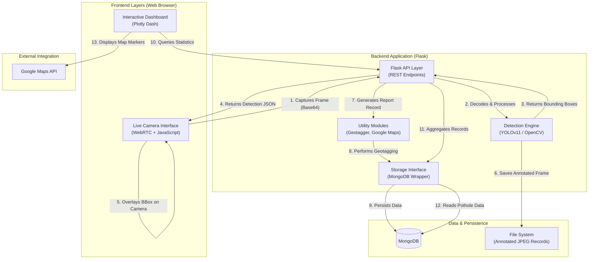

# RoadWatch AI - Project Flowchart

This document illustrates the high-level architecture and data flow of the RoadWatch AI monitoring system.

## High-Level Architecture (HLA)

The system consists of a Flask-based backend, a Plotly Dash visual dashboard, a YOLO-powered detection engine, and a MongoDB database for persistence.

## Data Flow Description

1.  **Live Monitoring**: The user visits the `/camera/start` page. The browser requests camera access via WebRTC. JavaScript captures frames every 1.5 seconds and sends them to the Flask `/api/detect_frame` endpoint.
2.  **Detection**: The backend decodes the image and passes it to the `YoloDetect` module. YOLO identifies potholes or hazards and calculates severity based on confidence.
3.  **Alerting & Storage**: If a hazard is detected, the frame is annotated with a bounding box and saved to the `static/images` directory. A record (timestamp, severity, confidence, image path) is created and stored in the **MongoDB** database.
4.  **Visualization**: The **Plotly Dash** dashboard (mounted at `/dashboard/`) fetches aggregated data from the API. It provides real-time statistics (fix rate, hourly trends, severity distribution) and an interactive map showing the location of detected potholes using the **Google Maps API**.
5.  **Actionable Insights**: Users can view hotspot zones where multiple hazards are clustered and mark potholes as "Fixed," which updates the status in the database.
