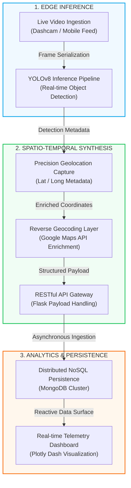

# RoadWatch AI - System Architecture & Data Flow

This document details the **Asynchronous Computer Vision & Geospatial Telemetry Pipeline** that powers RoadWatch AI.

## 🚀 Architectural Blueprint

The system utilizes a multi-stage lifecycle to transform raw visual telemetry into actionable infrastructure intelligence.

## 🛠️ Technical Process Decomposition

1.  **Computer Vision Ingestion**: Real-time video streams (dashcam or mobile) are fed into the high-performance YOLOv8 inference pipeline for localized defect detection.
2.  **Inference & Classification**: Our optimized deep learning model identifies infrastructure hazards (potholes, cracks, etc.) with high precision and low edge latency.
3.  **Spatio-Temporal Enrichment**: Detection events are instantly correlated with high-precision GPS telemetry, capturing the exact geographic coordinates of each infrastructure defect.
4.  **Geographic Resolver**: Automated reverse geocoding via the Google Maps Platform translates raw coordinates into human-readable municipal addresses for actionable reporting.
5.  **Asynchronous Data Ingestion**: Structured data payloads (hazard snapshots, location metadata, and severity rankings) are securely ingested via the Flask REST API.
6.  **Distributed Persistence & Visualization**: Aggregated data is persisted in a MongoDB cluster and surfaced via a real-time Plotly Dash dashboard for interactive heatmapping and decision support.

---

### **INGRESS → INFERENCE → INSIGHTS**
