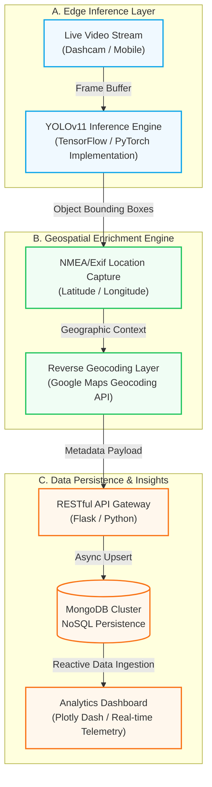

# RoadWatch AI - Automated Road Infrastructure Monitoring

## 🌟 Overview

**RoadWatch AI** is a cutting-edge **Computer Vision-as-a-Service (CVaaS)** platform engineered to modernize municipal infrastructure management. By synthesizing deep learning inferences with real-time geospatial telemetry, RoadWatch AI converts raw visual data into a **High-Fidelity Digital Twin** of road health, enabling predictive maintenance and rapid response workflows.

### 🚀 Technical Highlights

*   **⚡ Real-Time Inference Pipeline**: High-throughput object detection and classification utilizing an optimized YOLOv11 architecture for instantaneous hazard identification.
*   **📍 Geospatial Data Synthesis**: Automated spatio-temporal enrichment using high-precision coordinate mapping and Google Maps Reverse Geocoding.
*   **📊 Dynamic Telemetry Dashboard**: Interactive BI-ready visualization engine for hotspot density analysis, frequency trending, and cluster mapping.
*   **🛠️ Reactive Incident Orchestration**: End-to-end automated reporting lifecycle, bridging the gap between detection and municipal resolution.

---


## 🛠️ Tech Stack & Tools


---

## 🏗️ High-Level Logic & System Architecture (HLL)

RoadWatch AI operates on a sophisticated **Asynchronous Computer Vision & Geospatial Telemetry Pipeline**. We utilize an edge-first approach where inference is performed in real-time, followed by reactive data enrichment and persistence.



### 🧠 The Core Technical Cycle
1.  **Computer Vision Inference**: Real-time object detection using a YOLOv8-powered pipeline tuned for edge latency.
2.  **Spatio-Temporal Correlation**: Dynamic binding of detection timestamps with high-precision GPS telemetry.
3.  **Geographic Enrichment**: Automated address resolution via Reverse Geocoding for municipal-ready reporting.
4.  **Asynchronous Data Ingestion**: Secure transmission of high-dimensional metadata (images, location, severity) via REST API.
5.  **Multi-Dimensional Persistence**: Distributed NoSQL storage in MongoDB for scalable historical auditing.
6.  **Real-Time Telemetry Visualization**: Interactive Heat-mapping and Frequency Analysis using Plotly Dash.

---
### 📁 Detailed Project Architecture

```text
Road-Management-System/
├── app.py                # RESTful API Backend (Flask Layer)
├── dashboard.py          # Analytics & Telemetry Dashboard (Plotly Dash)
├── yolo_detect.py        # Computer Vision Logic (YOLOv8 Wrapper)
├── storage.py            # Data Ingestion & Persistence (MongoDB Handler)
├── LiveCamera.py         # Subprocess-driven Real-time Stream Controller
├── geotagger.py          # Geospatial Enrichment & Coordinate Handler
├── google_maps.py        # Integration with Google Maps Platform API
├── reporter.py           # Automated Incident Reporting Logic
├── monitoring.py         # System Health & Surveillance Diagnostics
├── config.py             # Global Hyperparameters & Environment State
├── .env                  # Encrypted Secret Store (API Keys, DB URIs)
│
├── static/               # Artifact Storage (Detected Pothole Snapshots)
├── public/               # Static Assets & Frontend Resources
├── models/               # Serialized Inferences & Weights (.pt / .weights)
├── runs/                 # ML Training Cycles & Evaluation Logs
└── requirements.txt      # Core Dependency Manifest
```

---

## ⚙️ Setup & Installation

### 1️⃣ Clone and Prepare
```bash
# Clone the repository
git clone https://github.com/yourusername/Road-Management-System.git
cd Road-Management-System

# Install dependencies
pip install -r requirements.txt
```

### 2️⃣ Configure Environment
Create a `.env` file in the root directory:
```env
# Database Configuration
MONGO_URI=mongodb://localhost:27017
MONGO_DB=road_monitoring
MONGO_COLLECTION=potholes

# API Keys
GOOGLE_MAPS_API_KEY=your_google_maps_api_key_here

# Application Settings
FLASK_SECRET_KEY=generate_a_secure_key
FLASK_PORT=8050

# Model Sensitivity
DETECTION_INTERVAL=10
CONFIDENCE_THRESHOLD=0.5
```

---

## 🚦 Usage

1.  **Launch the System**:
    ```bash
    python app.py
    ```
2.  **Access the Analytics Dashboard**:
    Open [http://localhost:8050/dashboard/](http://localhost:8050/dashboard/)
3.  **Initiate Monitoring Loop**:
    Directly start the feed via: [http://localhost:8050/camera/start?source=0](http://localhost:8050/camera/start?source=0)

---

## 📡 API Reference

| Endpoint | Method | Purpose |
| :--- | :--- | :--- |
| `/health` | `GET` | System health and model connectivity check |
| `/api/report` | `POST` | High-level hazard reporting endpoint |
| `/api/potholes` | `GET` | Retrieve chronological detection records |
| `/api/stats` | `GET` | Dashboard data aggregation |
| `/api/hotspots` | `GET` | Clustered hazard density mapping |

---

## 📜 License
This project is licensed under the MIT License - see the LICENSE file for details.

---

