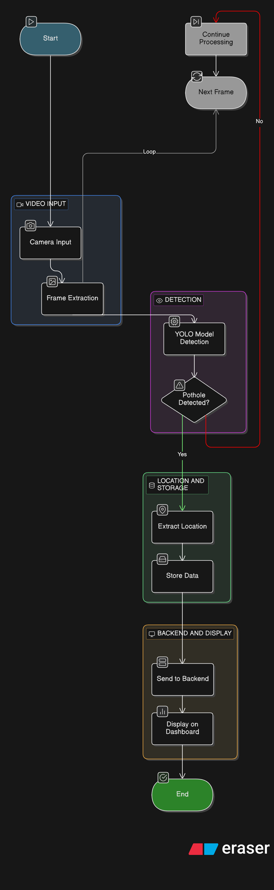

# RoadWatch AI - Automated Road Infrastructure Monitoring

An AI-powered road monitoring system that uses YOLO, OpenCV, Flask, Plotly Dash, Google Maps, and MongoDB to detect road hazards from dashcam footage and generate real-time reports for maintenance teams.

## Problem Statement

Manual inspection of potholes, cracks, broken streetlights, and related road hazards is slow, costly, and inconsistent. Delays between hazard appearance and repair increase accident risk, damage vehicles, and make it harder for city authorities to prioritize critical zones.

## Proposed Solution

This project turns a dashcam or roadside video stream into an automated monitoring workflow:

1. **Detection**: YOLO detects hazards such as potholes.
2. **Geocoding**: The system attaches GPS coordinates and reverse geocodes the location (via Google Maps) to each detection.
3. **Storage**: A Flask API stores hazard reports in MongoDB (with a local fallback if DB is offline).
4. **Dashboard**: A live, interactive dashboard built with Plotly Dash displays hotspot summaries, fix rates, and tracks statuses to help authorities prioritize repair zones.

## Technical Stack

- **Computer Vision**: YOLOv8 (via Ultralytics)
- **Image Processing**: OpenCV
- **Backend API**: Flask
- **Live Dashboard**: Plotly Dash
- **Geospatial Enrichment**: Google Maps Geocoding API
- **Storage**: MongoDB via `pymongo` with an in-memory local fallback

## Project Structure

```text
Road-Management-System/
|-- app.py                # Main Flask application and server entrypoint
|-- dashboard.py          # Plotly Dash interactive frontend mounted on Flask
|-- config.py             # Environment configuration mapping
|-- storage.py            # MongoDB/in-memory data operations
|-- yolo_detect.py        # YOLO model wrapper and detection logic
|-- LiveCamera.py         # Subprocess script to capture live OpenCV camera feeds
|-- reporter.py / geotagger.py  # Report assembly and geographic helpers
|-- requirements.txt      # Python dependencies
|-- .env                  # Configuration keys (must be created)
|-- static/               # Auto-generated detected hazard images
```

## Setup

1. **Install dependencies**:
```bash
pip install -r requirements.txt
```

2. **Configure your environment**:
Create a `.env` file in the root directory and add the following keys (customize as necessary):
```env
MONGO_URI=mongodb://localhost:27017
MONGO_DB=road_monitoring
MONGO_COLLECTION=potholes
GOOGLE_MAPS_API_KEY=your_google_maps_api_key_here
FLASK_SECRET_KEY=change_me
FLASK_PORT=8050
HIGH_MODEL_PATH=models/HighAccurate Model.pt
LOW_MODEL_PATH=models/LessAccurate Model.pt
CONFIDENCE_THRESHOLD=0.5
DETECTION_INTERVAL=10
```

## Usage

1. **Start the Application**:
Run the Flask server, which will initialize the API endpoints and mount the Dash dashboard:
```bash
python app.py
```
After starting, the console will print out the startup status including the loaded YOLO model and database connection state.

2. **View Dashboard**:
Open a browser and navigate to:
`http://localhost:8050/dashboard/`

3. **Start Camera Feed**:
To begin live monitoring, either click the "LIVE" button from the dashboard or navigate directly to:
`http://localhost:8050/camera/start?source=0`
(Change `source` to a file path like `Test/Pothole Exp1.mp4` for video file testing)

## API Endpoints

- `GET /health` : Service health check (DB routing, model status).
- `POST /api/report` : Submit a new hazard report (handles lat, lng, image_path, severity, confidence).
- `GET /api/potholes` : Fetch recent reports (accepts `limit` query param).
- `GET /api/stats` : Returns detailed stats: total, pending, in progress, fixed, fix rate, and hourly metrics.
- `GET /api/hotspots` : Lists concentrated areas (hotspots) with hazard recurrences.
- `POST /api/fix/<pothole_id>` : Mark a specific hazard id as fixed.

## 📸 Sample Output




## 🔁 Workflow Diagram


